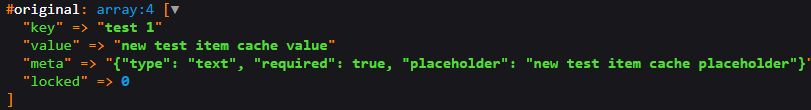

# Laravel Settings


[](https://packagist.org/packages/phu1237/laravel-settings)
[](https://github.com/Phu1237/laravel-settings/blob/master/LICENSE)

Global setting for Laravel. Can use in controllers, blades, etc.

## Content table

- [Installation](#installation)
- [Usage](#usage)
  - [Facade](#facade)
  - [Helpers](#helpers)
- [Command](#command)
- [Test](#test)
- [License](#license)

## Installation

- Require this package with composer:

```bash
composer require phu1237/laravel-settings
```

### Laravel auto-discovery

Laravel uses Package Auto-Discovery, so doesn't require you to manually add the ServiceProvider.

### Laravel without auto-discovery

If you don't use auto-discovery, add the ServiceProvider to the providers array in config/app.php:

```php
Phu1237\LaravelSettings\ServiceProvider::class,
```

If you want to use the facade, add this to your facades in app.php:

```php
'Setting' => Phu1237\LaravelSettings\Facades\Setting::class,
```

Or use this package facade

```php
use Phu1237\LaravelSettings\Facades\Setting;
```

- Then run migrate to create settings table:

```bash
php artisan migrate
OR
php artisan migrate --path=vendor/phu1237/laravel-settings/database/migrations
```

- Done. You can use all functions now.

## Usage

**Example setting row:**


You can use both **Facade** and **Helpers** to get or set the setting.

### Facades

```php
// Get
Setting::all(); // Get all settings items
Setting::get('key'); // Get settings item
Setting::value('key'); // Get settings item value
Setting::value('key', 'default'); // Get settings item value with default
Setting::meta('key'); // Get meta
Setting::meta('key', 'attribute'); // Get meta attribute
Setting::meta('key', 'attribute', 'default'); // Get meta attribute with default
// Set
Setting::set('key', 'value');
Setting::set(['key' => 'value']);
Setting::value('key', 'value');
Setting::value(['key' => 'value']);
Setting::meta('key', 'attribute', 'value');
Setting::meta('key', ['attribute' => 'value']);
// Other
Setting::has('key');
Setting::forget('key');
Setting::forget(['key1', 'key2']);
```

### Helpers

To get field from setting:

```php
// Get settings manager
settings('key');
settings()->get('key');
// Get value of setting
settings()->value('key');
settings()->value('key', 'default value');
// Get meta(s) from setting
settings()->meta('key');
settings()->meta('key', 'attribute');
settings()->meta('key', 'attribute', 'default value');
```

To set field value to setting:

```php
// Set value for single key
settings()->set('key', 'value');
// Set value for single or multiple key(s)
settings([
    'key1' => 'value1',
    'key2' => 'value2'
]);
settings()->value([
    'key1' => 'value1',
    'key2' => 'value2'
]);
settings()->set([
    'key1' => 'value1',
    'key2' => 'value2'
]);
// Set meta for single or multiple attribute(s)
settings()->meta('key', [
    'attribute1' => 'value1',
    'attribute2' => 'value2'
]);
```

Other:

```php
// Get all settings
settings()->all();
// Check if setting exists or not
settings()->has('key');
// Update or create with key(string), value(string), meta(array)
settings()->store('key', 'value', 'meta');
// Forget (Destroy) setting
settings()->forget('key');
settings()->forget(['key1', 'key2']);
settings()->flush();
```

### Blade directive

Get setting value:

```php
@setting('key', 'default value')
@setting_meta('key', 'meta', 'default value')
```

### Blade component

```html
<x-setting-input key="key" default="default" class="your-class" style="your-styles" />
```

## Command

Publish all package files:

```bash
php artisan settings:publish
```

Copy the package config to your local config with the publish command:

```bash
php artisan vendor:publish --provider="Phu1237\LaravelSettings\ServiceProvider" --tag=config
```

Copy the package tests to your local tests with the publish command:

```bash
php artisan vendor:publish --provider="Phu1237\LaravelSettings\ServiceProvider" --tag=tests
```

## License

The Laravel Settings is open-sourced software licensed under the [MIT license](http://opensource.org/licenses/MIT).
